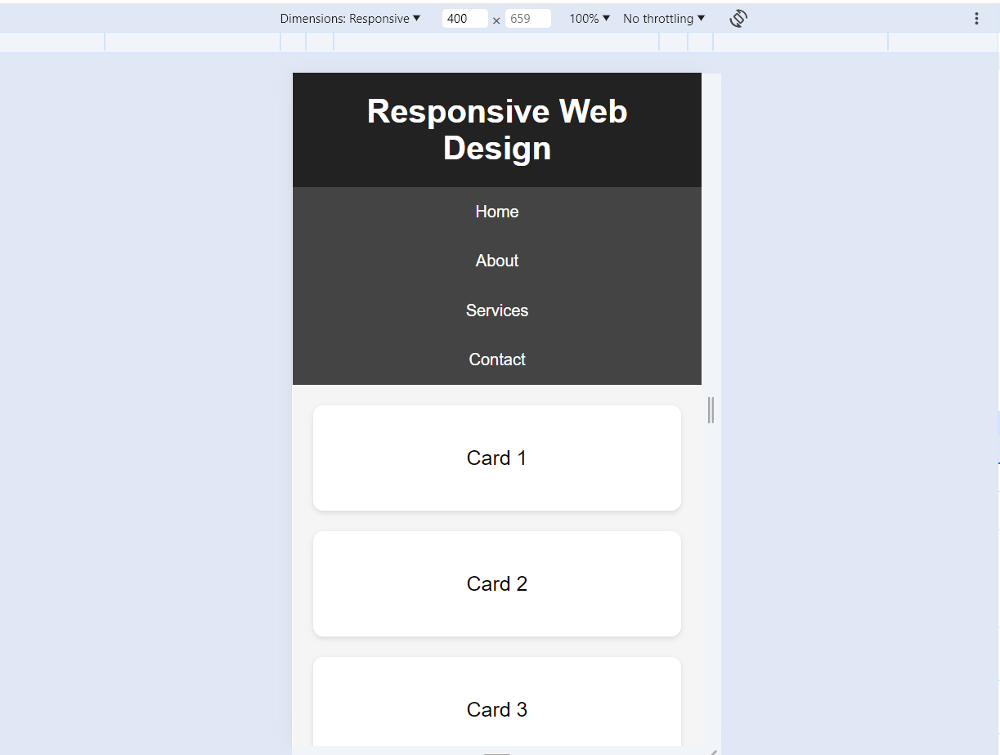
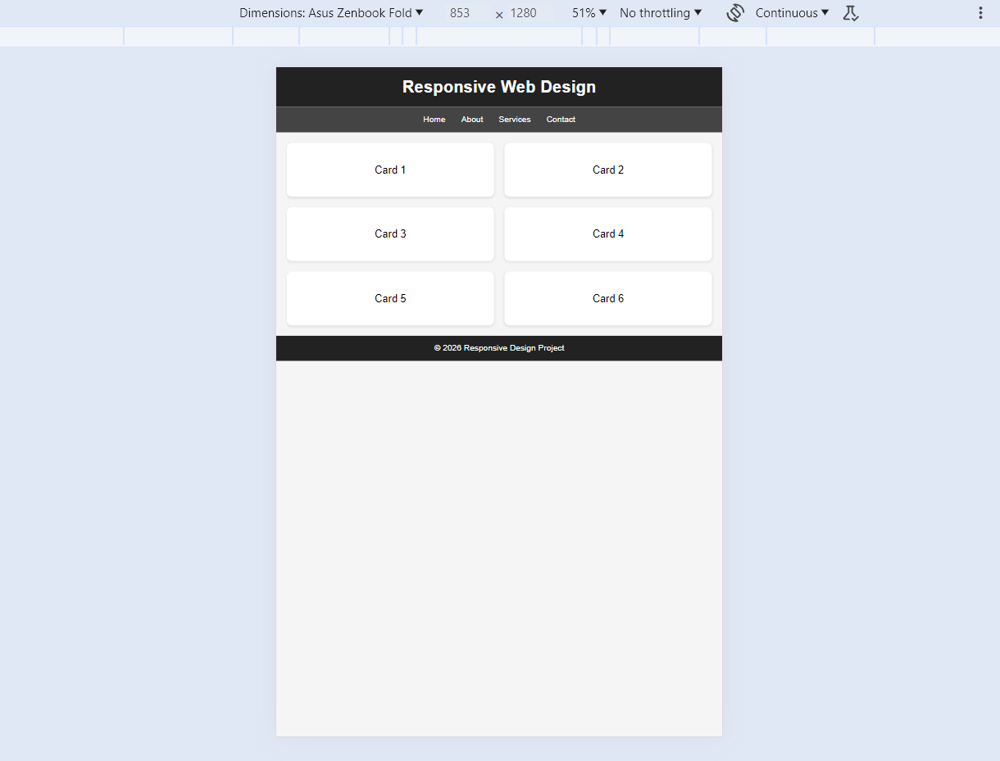
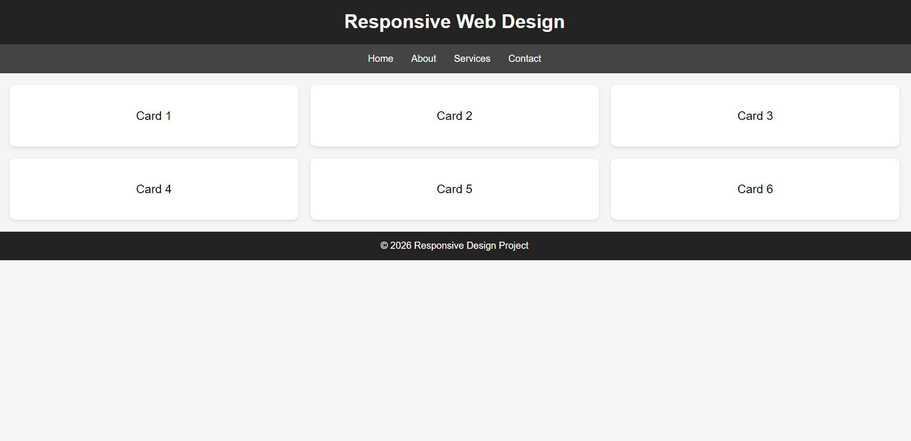

# Responsive Design using Flexbox & CSS Grid
---

## Features
- Responsive navigation bar using Flexbox
- Multi-column responsive layout using CSS Grid
- Mobile-first design approach
- Works on Mobile, Tablet, and Desktop screens

---

## Technologies Used
- HTML5
- CSS3
- Flexbox
- CSS Grid

---

## Screenshots

### Mobile View
Add screenshot here:

### Tablet View
Add screenshot here:

### Desktop View
Add screenshot here:

---

